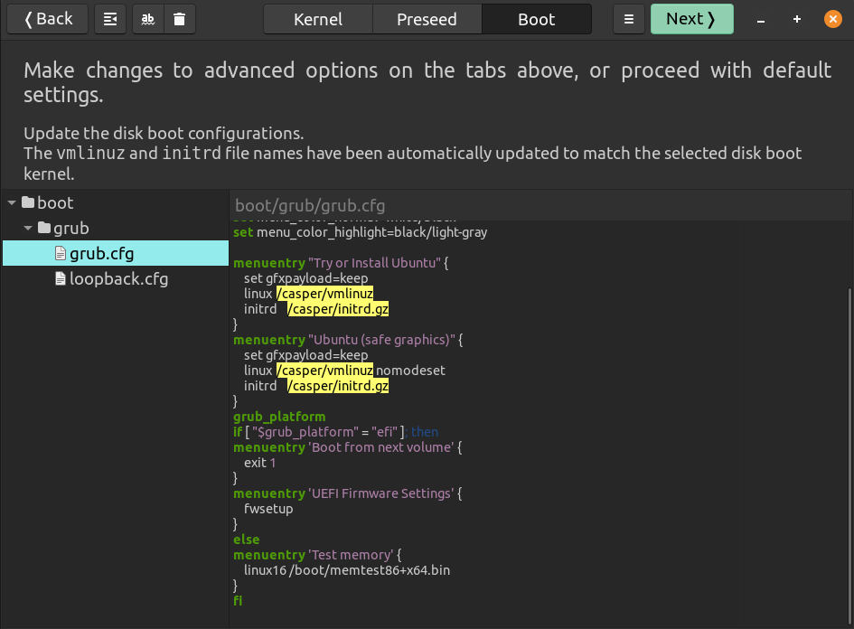

### ⚠️ GRUB and Boot Splash Considerations in Custom Ubuntu ISOs

When building a custom Ubuntu-based ISO using **Cubic**, one of the legal and technical considerations involves the **boot splash image and GRUB configuration**. Ubuntu’s default boot process includes branding (Lubuntu/Ubuntu logos) that you **cannot redistribute** without permission. Understanding how this works and how to handle it is essential.

---

#### 1️⃣ Live Boot vs Installed System

* **Live Boot:**

  * When the ISO is booted directly from media (USB/DVD), the **GRUB loader** shows the initial boot menu.
  * The **first screen** often includes the Ubuntu or Lubuntu splash screen.
  * Editing Plymouth themes **inside the Cubic environment does not affect the live boot splash**. The live system is still using the original Ubuntu branding.

* **Installed System:**

  * Once the ISO is installed to disk, the changes you made in Plymouth and custom themes will apply.
  * The installed system can display your **custom splash screen and branding**.

**Key Takeaway:** The first boot from live media will always show the default splash unless you intervene at the GRUB level.

---

#### 2️⃣ Legal Workaround: Removing Ubuntu Branding

To avoid displaying Ubuntu branding during **first boot**, modify the GRUB configuration after exiting the Cubic virtual environment:



1. Open the GRUB configuration file in your `custom-root`:

```text
custom-root/boot/grub/grub.cfg
```

2. Locate the kernel boot line that looks like this:

```text
linux /vmlinuz ... quiet splash
```

3. **Remove the `--quiet splash` options**, leaving:

```text
linux /vmlinuz ...
```

**Effect:**

* Disables the Ubuntu splash screen during live boot.
* Prevents legal issues related to redistribution of Ubuntu’s branding.
* The system still boots normally, showing only textual output until installation.

---
