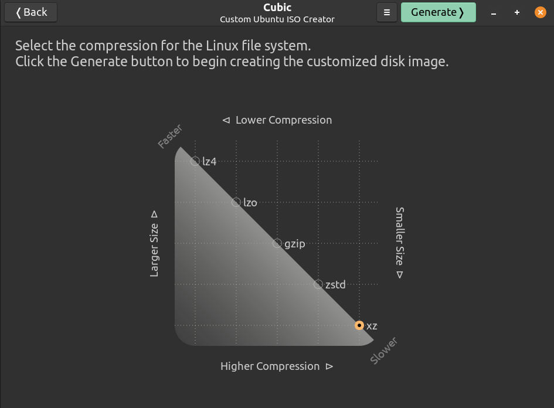

### 💾 ISO Compression Tips

In **Cubic**, you can choose the **ISO compression method** for your custom build:

* **Prototype / Testing Builds:** Select the **top option** (fastest compression) to quickly generate ISOs for testing and iteration.
* **Final / Release Builds:** Select the **bottom option** (maximum compression) to produce a smaller, optimized ISO suitable for distribution.

This ensures faster development cycles while keeping release images compact and efficient.